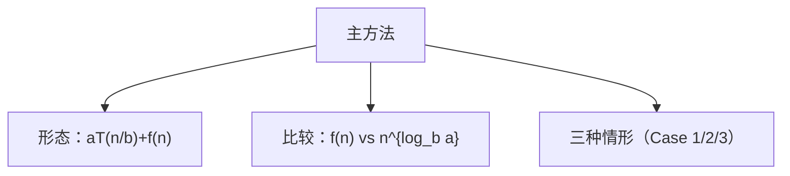

# 4.5 主方法

> [!abstract] 概览
> - ==主方法==：快速求解形如 $T(n)=aT(n/b)+f(n)$ 的递归式
> - 关键：比较 $f(n)$ 与 $n^{\\log_b a}$ 的增长关系

## 素材
- [[Content/00-Raw素材/算法/CLRS4/算法导论_第四版/Part_I_Foundations/4_Divide-and-Conquer/4.5_The_master_method_for_solving_recurrences.pdf|分片PDF：4.5 Master method]]

---

## 知识结构图

---

## 核心内容（学习记录）

> [!def] 三种情形（你按书补全）
> 令 $g(n)=n^{\\log_b a}$：  
> - Case 1：$f(n)=O(g(n) / n^{\\epsilon})$ ⇒ {结论}  
> - Case 2：$f(n)=Θ(g(n)\\log^k n)$ ⇒ {结论}  
> - Case 3：$f(n)=Ω(g(n) n^{\\epsilon})$ 且满足正则条件 ⇒ {结论}

> [!example] 常见例子
> - 归并排序：$T(n)=2T(n/2)+Θ(n)$ ⇒ $Θ(n\\log n)$  
> - Strassen：$T(n)=7T(n/2)+Θ(n^2)$ ⇒ $Θ(n^{\\log_2 7})$

> [!warning] 易错点
> - ❌ 忽略 Case 3 的正则条件
> - ✅ Case 3 必须检查：$a f(n/b) \\le c f(n)$（某个 c<1）

---

## 参见 Wiki（候选）
- [[主方法]]
- [[递归式]]

