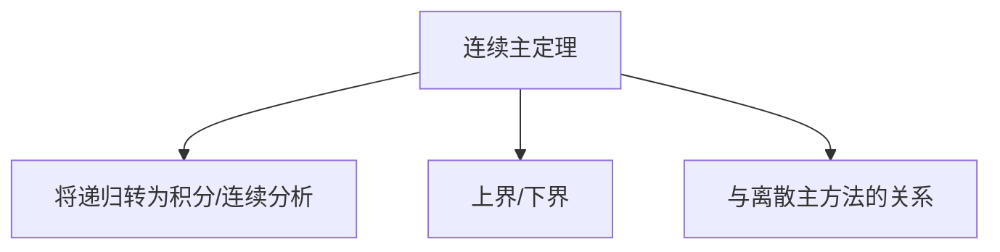

# 4.6 连续主定理证明

> [!abstract] 概览
> - 本节是主方法背后的“严格证明”（偏数学推导）
> - 目标：理解证明思路与适用边界（不要求背诵全部细节）

## 素材
- [[Content/00-Raw素材/算法/CLRS4/算法导论_第四版/Part_I_Foundations/4_Divide-and-Conquer/4.6_Proof_of_the_continuous_master_theorem.pdf|分片PDF：4.6 Proof of the continuous master theorem]]

---

## 知识结构图

---

## 核心内容（学习记录）
> [!tip] 阅读策略
> - 先抓结论：证明要支持 4.5 的三种情形
> - 再抓关键步骤：从递归展开到连续近似/积分界
> - 最后看技术细节：边界项与常数处理

> [!warning] 易错点
> - ❌ 把证明当成“必须会推一遍”
> - ✅ 作为工具：理解条件、知道何时不能直接套主方法

---

## 参见 Wiki（候选）
- [[主方法]]
- [[连续主定理]]

