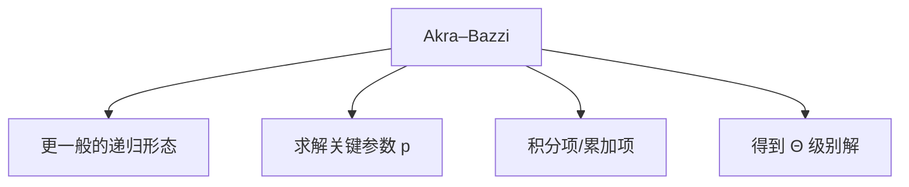

# 4.7 Akra–Bazzi 递归式

> [!abstract] 概览
> - ==Akra–Bazzi==：推广主方法，可处理更一般的分治递归式（子问题规模不一定严格是 n/b）
> - 目标：知道它解决“主方法覆盖不到的递归式”

## 素材
- [[Content/00-Raw素材/算法/CLRS4/算法导论_第四版/Part_I_Foundations/4_Divide-and-Conquer/4.7_Akra-Bazzi_recurrences.pdf|分片PDF：4.7 Akra–Bazzi recurrences]]

---

## 知识结构图

---

## 核心内容（学习记录）
> [!tip] 你只需要记住三件事
> 1) 什么时候用：主方法不适用的分治递归式  
> 2) 怎么用：找到参数 p（满足某个平衡条件）  
> 3) 结果形式：$T(n)=Θ\\left(n^p\\left(1+\\int_1^n \\frac{f(u)}{u^{p+1}}du\\right)\\right)$（按书核对）

> [!warning] 易错点
> - ❌ 把它当成“万能主方法”直接硬套
> - ✅ 先确认递归式满足 Akra–Bazzi 的前提条件

---

## 参见 Wiki（候选）
- [[主方法]]
- [[Akra–Bazzi]]

