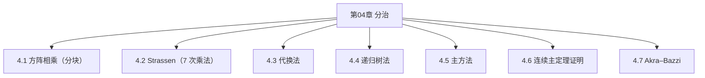

# 第04章 分治 — 章节汇总

> [!abstract] 本章你应该掌握
> - ==分治范式==：分解 → 解决 → 合并，并能写出递归式
> - ==矩阵乘法案例==：常规分块乘法 vs Strassen（8 次乘法 → 7 次乘法）
> - ==递归式求解工具箱==：代换法、递归树、主方法，以及更一般的 Akra–Bazzi

---

## 本章知识框架

---

## 各节索引
- [[4.1 方阵相乘]]
- [[4.2 Strassen 矩阵乘法算法]]
- [[4.3 代换法求解递归式]]
- [[4.4 递归树法求解递归式]]
- [[4.5 主方法]]
- [[4.6 连续主定理证明]]
- [[4.7 Akra-Bazzi 递归式]]

---

## 本章素材（分片）
- [[Content/00-Raw素材/算法/CLRS4/算法导论_第四版/Part_I_Foundations/4_Divide-and-Conquer/4.1_Multiplying_square_matrices.pdf|PDF：4.1 Multiplying square matrices]]
- [[Content/00-Raw素材/算法/CLRS4/算法导论_第四版/Part_I_Foundations/4_Divide-and-Conquer/4.2_Strassen’s_algorithm_for_matrix_multiplication.pdf|PDF：4.2 Strassen’s algorithm]]
- [[Content/00-Raw素材/算法/CLRS4/算法导论_第四版/Part_I_Foundations/4_Divide-and-Conquer/4.3_The_substitution_method_for_solving_recurrences.pdf|PDF：4.3 Substitution method]]
- [[Content/00-Raw素材/算法/CLRS4/算法导论_第四版/Part_I_Foundations/4_Divide-and-Conquer/4.4_The_recursion-tree_method_for_solving_recurrences.pdf|PDF：4.4 Recursion-tree method]]
- [[Content/00-Raw素材/算法/CLRS4/算法导论_第四版/Part_I_Foundations/4_Divide-and-Conquer/4.5_The_master_method_for_solving_recurrences.pdf|PDF：4.5 Master method]]
- [[Content/00-Raw素材/算法/CLRS4/算法导论_第四版/Part_I_Foundations/4_Divide-and-Conquer/4.6_Proof_of_the_continuous_master_theorem.pdf|PDF：4.6 Continuous master theorem proof]]
- [[Content/00-Raw素材/算法/CLRS4/算法导论_第四版/Part_I_Foundations/4_Divide-and-Conquer/4.7_Akra-Bazzi_recurrences.pdf|PDF：4.7 Akra–Bazzi recurrences]]
- [[Content/00-Raw素材/算法/CLRS4/算法导论_第四版/Part_I_Foundations/4_Divide-and-Conquer/Problems.pdf|PDF：Chapter 4 Problems]]

---

## 关键结论（你学习后补全）
1. {结论 1}
2. {结论 2}

